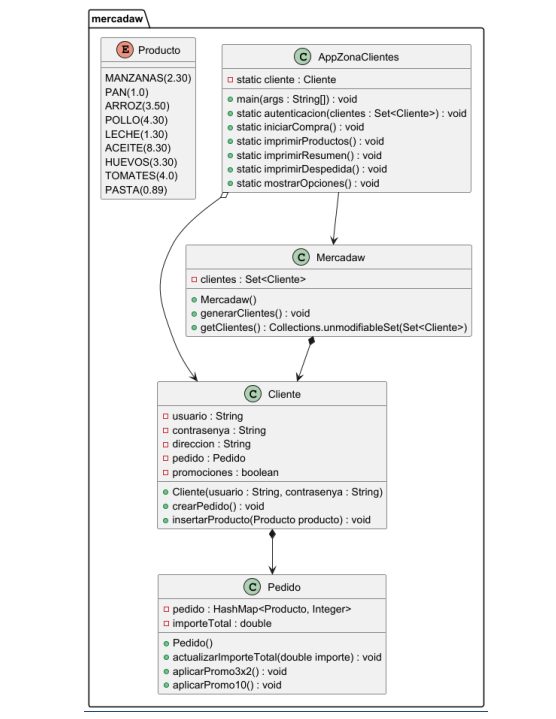

# Práctica Mercadam. 

## Índice
1. [Intro](#1-intro)
2. [Estructura de clases](#2-estructura-de-clases)
    - [Diagrama de clases UML](#diagrama-de-clases-uml)
    - [Contenido de las clases .java](#contenido-de-las-clases-java)
3. [Programa principal (app)](#3-programa-principal-app)
4. [Entrega](#4-entrega)

### 1. Intro
> Para esta práctica creamos un programa para realizar pedidos de comida online.
> Tenemos una clase Cliente, Pedido, Mercadam y un Enum Productos, donde se almacenan los productos disponibles para compra. El funcionamiento consta de los siguientes pasos: 
> 1. Se crean usuarios y contraseñas para clientes. Estos se usan para acceder al programa como cliente
> 2. Se eligen productos de la lista. Estos productos tienen un precio que se va sumando al precio total del pedido.
> 3. Una vez acabemos eligiendo productos, podemos aplicar ofertas a nuestro importe total, podemos ordenar nuestro pedido por cantidad de productos de forma descendente y podemos eliminar productos de nuestro pedido.

<br>


### 2. Estructura de clases

#### Diagrama de clases UML 


#### Contenido de las clases
- Producto.java
````
public enum Producto {
    MANZANAS(2.30),
    PAN(1.0),
    ARROZ(3.50),
    POLLO(4.30),
    LECHE(1.30),
    ACEITE(8.30),
    HUEVOS(3.30),
    TOMATES(4.0),
    PASTA(0.89);

    private double precio;

    Producto(double precio) {
        this.precio = precio;
    }

    public double getPrecio() {
        return precio;
    }
}

````
[Link a la clase en gihub](https://github.com/adrigeada/programacion_ud7/blob/main/programacion_ud7/src/main/java/org/example/PracticaMercadona/Producto.java)
<br>

- Cliente.java
````
package org.example.PracticaMercadona;

import java.util.HashMap;
import java.util.Objects;

public class Cliente implements Comparable<Cliente>{
    static final String CALLE = "Calle falsa, 123";

    private String usuario;
    private String contrasenya;
    private String direccion;
    private Pedido pedido;
    private boolean promociones;

    public Cliente(String usuario, String contrasenya) {
        this.usuario = usuario;
        this.contrasenya = contrasenya;
        direccion = CALLE;
        pedido = null;
        promociones = false;
    }

    /**
     * Pedido empieza en null, este método inicializa el pedido.
     */
    public void crearPedido(){
        pedido = new Pedido();
    }

    /**
     * Guardo el mapa del pedido. En este mapa compruebo si el pedido recibido por parametro existe en el mapa. Si no existe lo meto al mapa, si existe se le hace un +1 al valor del producto
     * @param producto
     */
    public void insertarProducto(Producto producto){
        HashMap<Producto,Integer> pedidoMapa = pedido.getPedidoMapa();

        if (pedidoMapa.containsKey(producto)){
            pedidoMapa.put(producto,pedidoMapa.get(producto)+1);
        }else {
            pedidoMapa.put(producto,1);
        }

        System.out.println("Has añadido "+producto+" con un precio de "+producto.getPrecio()+"€");

        pedido.actualizarImporteTotal(producto.getPrecio());

    }

    public boolean isPromociones() {
        return promociones;
    }

    public void setPromociones(boolean promociones) {
        this.promociones = promociones;
    }

    public Pedido getPedido() {
        return pedido;
    }

    public void setPedido(Pedido pedido) {
        this.pedido = pedido;
    }

    public String getDireccion() {
        return direccion;
    }

    public void setDireccion(String direccion) {
        this.direccion = direccion;
    }

    public String getContrasenya() {
        return contrasenya;
    }

    public void setContrasenya(String contrasenya) {
        this.contrasenya = contrasenya;
    }

    public String getUsuario() {
        return usuario;
    }

    public void setUsuario(String usuario) {
        this.usuario = usuario;
    }

    @Override
    public String toString() {
        return "Cliente{" +
                "usuario='" + usuario + '\'' +
                ", contrasenya='" + contrasenya + '\'' +
                ", direccion='" + direccion + '\'' +
                ", pedido=" + pedido +
                ", promociones=" + promociones +
                '}';
    }


    @Override
    public boolean equals(Object o) {
        if (o == null || getClass() != o.getClass()) return false;
        Cliente cliente = (Cliente) o;
        return Objects.equals(usuario, cliente.usuario) && Objects.equals(contrasenya, cliente.contrasenya);
    }

    @Override
    public int hashCode() {
        return Objects.hash(usuario, contrasenya);
    }


    /**
     * Los clientes se ordenan por orden alfabético del usuario. Si tienen el mismo usuario se ordenan alfabeticamente por la constraseña
     * @param o
     * @return
     */
    @Override
    public int compareTo(Cliente o) {

        int comparar = usuario.compareTo(o.getUsuario());

        if (comparar != 0){
            return comparar;
        }

        return contrasenya.compareTo(o.getContrasenya());
    }
}

````
[Link a la clase en gihub](https://github.com/adrigeada/programacion_ud7/blob/main/programacion_ud7/src/main/java/org/example/PracticaMercadona/Cliente.java)
<br>

- Mercadam.java
````
package org.example.PracticaMercadona;

import java.util.*;

public class Mercadam {
    static Random aleatorio = new Random();
    static String caracteres = "ABCDEFGHIJKLMNOPQRSTUVWXYZabcdefghijklmnopqrstuvwxyz0123456789";

    private Set<Cliente> listaClientes;

    public Mercadam(){
        listaClientes = new TreeSet<>();
    }

    /**
     * Se genera un usuario y contraseña de 8 caracteres de forma aleatoria. Con esto se crea un cliente y se añade a la listaClientes
     */
    public void generarClientes(){
        String usuario = "";
        String pass = "";

        for (int i = 0; i < 8; i++) {
            usuario+=caracteres.charAt(aleatorio.nextInt(caracteres.length()));
        }

        for (int i = 0; i < 8; i++) {
            pass+=caracteres.charAt(aleatorio.nextInt(caracteres.length()));
        }

        Cliente cliente = new Cliente(usuario,pass);
        listaClientes.add(cliente);
    }


    /**
     * @return la listaClientes a la que se le han añadido los clientes, la devuelve de forma inmodificable.
     */
    public Set<Cliente> getListaClientes() {
        return Collections.unmodifiableSet(listaClientes);
    }

    public void setListaClientes(Set<Cliente> listaClientes) {
        this.listaClientes = listaClientes;
    }

    @Override
    public String toString() {
        return "Mercadam{" +
                "clientes=" + listaClientes +
                '}';
    }


}

````
[Link a la clase en gihub](https://github.com/adrigeada/programacion_ud7/blob/main/programacion_ud7/src/main/java/org/example/PracticaMercadona/Mercadam.java)
<br>

- Pedido.java
````
package org.example.PracticaMercadona;

import java.util.HashMap;
import java.util.Map;

public class Pedido {
    static final double DESCUENTO =0.90;

    private HashMap<Producto,Integer> pedidoMapa;
    private double importeTotal;

    public Pedido() {
        pedidoMapa = new HashMap<>();
        importeTotal = 0;
    }

    /**
     * Recibe un importe y lo suma al importeTotal
     * @param importe
     */
    public void actualizarImporteTotal(double importe){
        importeTotal+=importe;
        System.out.println("Importe total del pedido: "+importeTotal+"€");
    }

    /**
     * Comprueba si en el pedido hay productos mayores de 3 y/o divisibles entre 3. Si los hay, aplica el descuento de 3x2 al importe total
     */
    public void aplicarPromo3x2(){

        for (Map.Entry<Producto,Integer> mapita : pedidoMapa.entrySet()){
            if (mapita.getValue() % 3 == 0 ){
                importeTotal = importeTotal-mapita.getKey().getPrecio()*(mapita.getValue())/3;
            } else if (mapita.getValue() > 3) {
                int resta = mapita.getValue()/3;
                double restaTotal = mapita.getKey().getPrecio()*resta;

                importeTotal = importeTotal-restaTotal;

            }
        }

    }

    /**
     * Le aplica un 10% de descuento al importe total
     */
    public void aplicarPromo10(){
        importeTotal = importeTotal*DESCUENTO;

    }

    public double getImporteTotal() {
        return importeTotal;
    }

    public void setImporteTotal(double importeTotal) {
        this.importeTotal = importeTotal;
    }

    public HashMap<Producto, Integer> getPedidoMapa() {
        return pedidoMapa;
    }

    public void setPedidoMapa(HashMap<Producto, Integer> pedidoMapa) {
        this.pedidoMapa = pedidoMapa;
    }

    @Override
    public String toString() {
        return "Pedido{" +
                "pedido=" + pedidoMapa +
                ", importeTotal=" + importeTotal +
                '}';
    }
}

````
[Link a la clase en gihub](https://github.com/adrigeada/programacion_ud7/blob/main/programacion_ud7/src/main/java/org/example/PracticaMercadona/Cliente.java)
<br>


### 3. Programa principal (App)
````
package org.example.PracticaMercadona;

import java.util.*;

public class AppZonaClientes {
   static Random aleatorio = new Random();
   static Scanner teclado = new Scanner(System.in);
    static Cliente cliente;

    /**
     * Se crea un objeto mercadam que se usa para generar clientes y meterlos en la lista dentro de Mercadam. Después se recibe la lista inmodificable. Esta lista es la que se pasa
     * como parámetro al método autentication.
     */
    static void main() {

        Mercadam mercadam = new Mercadam();
        //Se genera una cantidad aleatoria de clientes
        int cantidadUsuarios = aleatorio.nextInt(10)+1;
        for (int i = 0; i < cantidadUsuarios; i++) {
            mercadam.generarClientes();
        }
        //Se recibe la lista de clientes inmodificable y la imprimimos para ver los usuarios y sus contraseñas
        Set<Cliente> listaClientes = mercadam.getListaClientes();
        System.out.println(cantidadUsuarios+" clientes generados: "+listaClientes);

        autentication(listaClientes);


    }

    /**
     * Recibe una lista de clientes. Se pide usuario y contraseña para acceder. Estos datos se buscan en la lista, si no coinciden con los datos de ningun cliente se vuelven a pedir y se resta un intento.
     * Tras 3 intentos fallidos el programa acaba con un return. Si coinciden, se usan para crear el cliente estático que hay en esta clase. Es el que vamos a usar para el resto del programa.
     * Se llama a iniciarCompra().
     * @param listaClientes
     */
    public static void autentication(Set<Cliente> listaClientes){
        int intentos = 3;
        String usuario ="";
        String contrasenya = "";

        System.out.println("=== COMPRA ONLINE EN MERCADAM ===");

        fuera:
        while(intentos>=0){

            if (intentos == 0){
                System.out.println("ERROR DE AUTENTICACIÓN");
                return;
            }

            System.out.println("Usuario: ");
            usuario = teclado.nextLine();
            System.out.println("Contraseña: ");
            contrasenya = teclado.nextLine();

            for (Cliente cliente : listaClientes){

                if (!cliente.getUsuario().equals(usuario) || !cliente.getContrasenya().equals(contrasenya)){
                    intentos--;
                    System.out.println("Credenciales no válidas. Intentos: "+intentos);
                    continue fuera;
                }else {
                    System.out.println("Bienvenido, "+usuario);
                    break fuera;
                }

            }

        }
        cliente = new Cliente(usuario,contrasenya);
        iniciarCompra();

    }

    /**
     * Se crea un pedido usando el cliente estático y se llama a imprimirProductos().
     */
    public static void iniciarCompra(){

        System.out.println("Creando un nuevo pedido...");

        cliente.crearPedido();
        imprimirProductos();

    }

    /**
     * Se imprimen por pantalla los productos que hay en el Enum Producto.
     * Se pide elegir un producto para añadir al pedido. Si no coincide con los Enums válidos se vuelve a pedir que se elija un producto válido.
     * Si el producto es válido, se inserta el producto al pedido con insertarProducto().
     * Finalmente se pregunta si queremos añadir mas productos al pedido. S para repetir, N para salir. Si sales, se llama a imprimirResumen()
     */
    public static void imprimirProductos(){
        Producto producto = null;
        boolean repetir;
        String siNo = "";


        do {
            repetir = false;
            System.out.println("\nElige un prodcuto de la lista...");

            for (Producto productito : Producto.values()){
                System.out.println(productito+": "+productito.getPrecio()+"€");
            }
            System.out.println("========================================");
            System.out.println("Elige un producto: ");

            try {
                producto = Producto.valueOf(teclado.nextLine().toUpperCase());
            }catch (IllegalArgumentException e){
                System.out.println("Producto no reconocido, elige otro...");
                repetir = true;
                continue;
            }

            //si no hago el continue, intenta insertar producto sin que producto exista.ERROR
            cliente.insertarProducto(producto);

            System.out.println("¿Quieres añadir más productos (S/N)?");
            siNo = teclado.nextLine();

            if (siNo.equalsIgnoreCase("s")){
                repetir = true;
            }

        }while (repetir);

        imprimirResumen();
    }

    /**
     * Usando un for each al mapa del pedido se enseñan los productos y las cantidades que hay en el pedido. Se llama a mostrarOpciones().
     */
    public static void imprimirResumen(){
        System.out.println("\n=== RESUMEN DE TU CARRITO DE LA COMPRA ===");
        System.out.println("Productos:");

        HashMap<Producto,Integer> mapaPedido = cliente.getPedido().getPedidoMapa();

        for (Map.Entry<Producto,Integer> mapita : mapaPedido.entrySet()){
            System.out.println(mapita.getValue()+" "+mapita.getKey()+" "+mapita.getKey().getPrecio());
        }

        System.out.println("IMPORTE TOTAL: "+cliente.getPedido().getImporteTotal()+"€");

        mostrarOpciones();
    }

    /**
     * Se imprimen las posibles opciones que hay al final del pedido. Con la respuesta se hace un switch-case
     */
    public static void mostrarOpciones(){

        System.out.println("\n========================================");
        System.out.println("¿Qué desea hacer?");
        System.out.println("[1]. Aplicar promos.");
        System.out.println("[2]. Mostrar resumen ordenado por uds.");
        System.out.println("[3]. Eliminar productos del pedido");
        System.out.println("[4]. Terminar pedido.");
        String opcion = teclado.nextLine();

        switch (opcion){

            case "1":
                aplicarPromo();
                break;
            case "2":
                ordenarPedido();
                break;
            case "3":
                eliminarProductos();
                break;
            default:
                imprimirDespedida();

        }

    }

    /**
     * Acaba el programa con una despedida.
     */
    public static void imprimirDespedida(){
        System.out.println("\n=== GRACIAS POR SU PEDIDO ===");
        System.out.println("Lo recibirá en unos días en la dirección "+cliente.getDireccion());
    }

    /**
     * Se comprueba si el atributo booleano de cliente, promociones es true o false. Si es true no se hace nada. Si es false se aplican ambos métodos de promoción,.
     */
    public static void aplicarPromo(){
        if (cliente.isPromociones()){
            System.out.println("Ya se han aplicado promociones");
        }else {
            cliente.getPedido().aplicarPromo3x2();
            cliente.getPedido().aplicarPromo10();
        }
        cliente.setPromociones(true);
        imprimirResumen();

    }

    /**
     * Se crea una lista Map.Entry a partir del mapa del pedido. Esta lista se ordena usando Map.Entry.comparingByValue(Comparator.reverseOrder()) para ordenar por value.
     * Luego uso esta lista ordenada para volver a imprimir el mapa.
     */
    public static void ordenarPedido(){
        System.out.println("\n=== RESUMEN DE TU CARRITO DE LA COMPRA ===");
        System.out.println("Productos ordenados por uds:");

        HashMap<Producto,Integer> mapaPedido = cliente.getPedido().getPedidoMapa();

        List<Map.Entry<Producto,Integer>> listaMapa = new ArrayList<>(mapaPedido.entrySet());

        listaMapa.sort(Map.Entry.comparingByValue(Comparator.reverseOrder()));

        for (Map.Entry<Producto,Integer> mapita : listaMapa){
            System.out.println(mapita.getValue()+" "+mapita.getKey()+" "+mapita.getKey().getPrecio()+"€");
        }

        System.out.println("\nIMPORTE TOTAL: "+cliente.getPedido().getImporteTotal()+"€");

        mostrarOpciones();

    }

    /**
     * Se crea un Iterator tipo Map.Entry a partir del mapa del pedido. Se pide que producto queremos borrar.
     * Recorremos el iterator con un hasNext(), guardamos un prodUd con next(). Si la key de este prodUd es igual al producto que hemos escrito entramos al if.
     * Si hay mas de una unidad de el producto elegido, actualizamos el valor a -1. Si hay uno, lo eliminamos con remove().
     */
    public static void eliminarProductos(){

        System.out.println("=== ELIMINAR PRODUCTOS ===");
        System.out.println("¿Qué producto quieres eliminar?");

        HashMap<Producto,Integer> mapaPedido = cliente.getPedido().getPedidoMapa();
        for (Map.Entry<Producto,Integer> mapita : mapaPedido.entrySet()){
            System.out.println(mapita.getValue()+" "+mapita.getKey()+" "+mapita.getKey().getPrecio());
        }
        Iterator<Map.Entry<Producto,Integer>> itmapa = mapaPedido.entrySet().iterator();

        Producto producto = Producto.valueOf(teclado.nextLine().toUpperCase());

        while (itmapa.hasNext()){
            Map.Entry<Producto,Integer> prodUd = itmapa.next();

            if (prodUd.getKey().equals(producto)){

                if (prodUd.getValue() > 1){
                    mapaPedido.put(producto, mapaPedido.get(producto)-1);
//                    prodUd.setValue(prodUd.getValue()-1);
                }else {
                    itmapa.remove();
                }
                break;

            }
        }

        imprimirResumen();

    }

}

````
[Link a la clase en github](https://github.com/adrigeada/programacion_ud7/blob/main/programacion_ud7/src/main/java/org/example/PracticaMercadona/AppZonaClientes.java)
<br>


### 4. Entrega

- [X] Código fuente en GitHub
- [X] Documentación
- [X] JavaDocs


